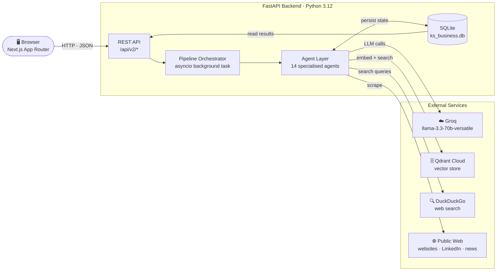
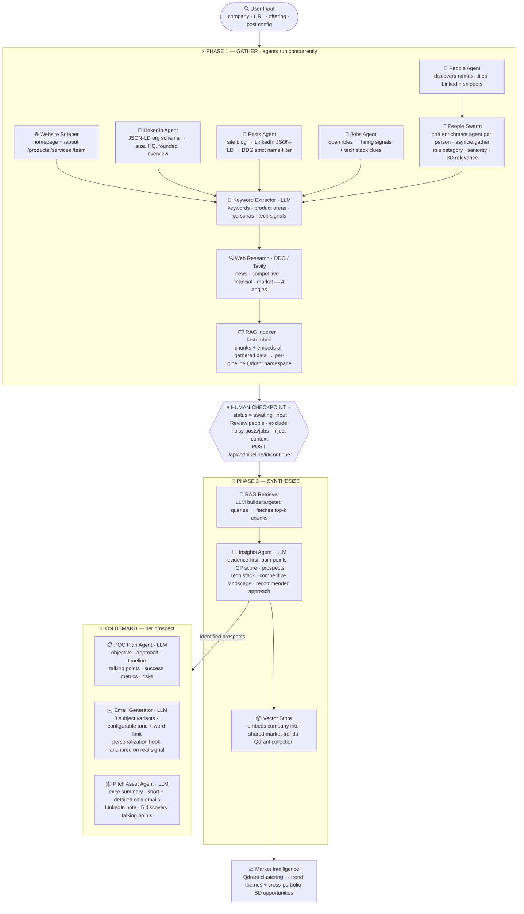
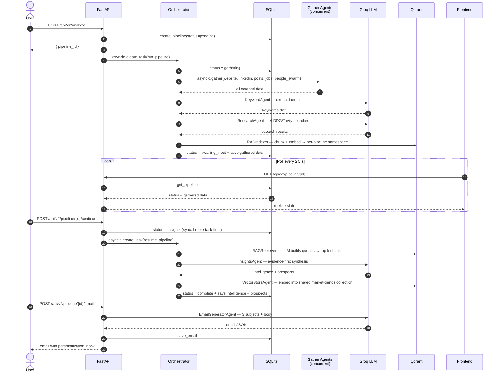
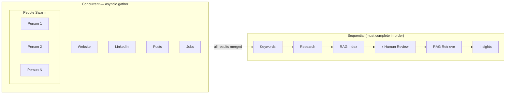
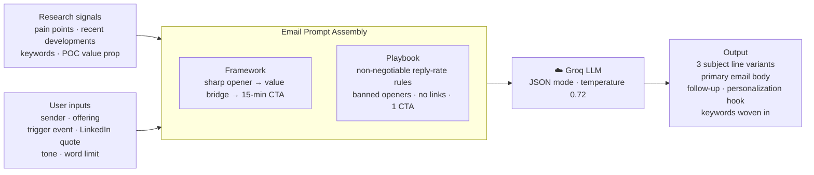

# KS Business — Knowledge Systems BD Intelligence

> **CRAIL Hackathon 2026** — A multi-agent pipeline that researches companies, scores engagement fit, identifies prospects, and generates hyper-personalised outreach — in under 30 seconds.

---

## The Problem

Business development is a research-heavy discipline that scales badly. A typical outbound BD rep spends **2–3 hours per prospect** before writing a single word of outreach:

1. Google the company, open 10 tabs
2. Browse LinkedIn for the right decision-makers
3. Read through blog posts, press releases, and job listings hunting for pain-point signals
4. Manually piece together a narrative that connects their problems to your solution
5. Write a cold email that still sounds generic — because there wasn't time to go deeper

The result is inconsistent output, missed signals, and response rates that make the whole effort feel futile. Scaling the team multiplies the cost without multiplying the quality.

---

## The Solution

KS Business collapses that 2–3 hour cycle into **a 30-second multi-agent pipeline**. You enter a company name, your offering, and an optional URL. The system:

- Scrapes the company website, LinkedIn org profile, recent posts, open job listings, and key personnel — **concurrently**
- Runs a **People Swarm**: one enrichment agent per discovered person fires in parallel to assess seniority, role category, and BD relevance
- Embeds every gathered fact into a **per-pipeline Qdrant vector namespace** for retrieval-augmented synthesis
- **Pauses for your review** — prune irrelevant people, exclude noisy posts, inject context the agents couldn't find
- Synthesises an **evidence-first intelligence report**: pain points with severity, ICP fit score (1–100 across six dimensions), prospects with contact angles, competitive landscape, and traceable sources
- Generates per-prospect **POC engagement plans** and **personalised outreach emails** on demand — 3 subject-line variants, configurable tone and word limit, personalization hook anchored on a real signal
- Embeds completed pipelines into a shared Qdrant collection that powers a **cumulative Market Intelligence view**

---

## System Architecture



---

## Agent Pipeline

Every pipeline run is split into two phases with a human-in-the-loop checkpoint between them. All gather agents run concurrently via `asyncio.gather`. Every stage writes its output to SQLite before proceeding — no work is lost if a stage fails or the user pauses.



---

## Multi-Agent Orchestration

### How agents are coordinated

The orchestrator (`pipeline.py`) runs as a single `asyncio.create_task` spawned from the FastAPI endpoint — the HTTP response returns immediately with a `pipeline_id` while the pipeline runs in the background. The frontend polls every 2.5 seconds.



### Tools used by each agent

| Agent | Tools / Libraries | Output |
|-------|------------------|--------|
| **WebsiteScraperAgent** | `requests` · `BeautifulSoup4` · DDG (URL discovery) | Pages: url, title, cleaned text |
| **LinkedInAgent** | `requests` · `BeautifulSoup4` (JSON-LD `<code>` tags) | Org schema: size, HQ, founded, description, founders |
| **PostsAgent** | `requests` · `BeautifulSoup4` · `duckduckgo-search` | Posts: title, text, url, source, date |
| **JobsAgent** | `duckduckgo-search` · `requests` | Jobs: title, location, url, snippet |
| **PeopleAgent + Swarm** | `duckduckgo-search` · `requests` · Groq LLM (one call per person) | People: name, title, seniority, role category, BD relevance |
| **KeywordAgent** | Groq LLM | Keywords, product areas, target personas, tech signals |
| **ResearchAgent** | `duckduckgo-search` / `tavily-python` (4 angle searches) | Research results: title, url, snippet, angle |
| **CrawlerAgent** | `requests` · `BeautifulSoup4` · `duckduckgo-search` | Crawl findings for thin public footprints |
| **RAGIndexer** | `fastembed` (ONNX) · `qdrant-client` | Embedded chunks in per-pipeline Qdrant namespace |
| **RAGRetriever** | Groq LLM (query planning) · `qdrant-client` (ANN search) | Top-k retrieved chunks |
| **InsightsAgent** | Groq LLM · RAG context | Intelligence report: pain points, ICP score, prospects, competitive analysis |
| **VectorStoreAgent** | `fastembed` · `qdrant-client` | Company embedding in shared `ks_business_intelligence` collection |
| **POCPlanAgent** | Groq LLM (JSON mode) | POC: objective, approach, timeline, talking points, risks |
| **EmailGeneratorAgent** | Groq LLM (JSON mode · temperature 0.72) | 3 subject variants, email body, follow-up, personalization hook |
| **PitchAssetAgent** | Groq LLM (JSON mode · 4096 tokens) | Exec summary, 2 cold emails, LinkedIn note, 5 talking points |
| **MarketTrendsGenerator** | `qdrant-client` · `scipy` (k-means) · Groq LLM | Trend clusters with theme, insight, BD opportunity |

### Concurrency model



---

### Email generation detail

The email generator follows an expert B2B sales copywriter framework — not a generic template.



---

## Design Decisions

| Decision | Rationale |
|----------|-----------|
| **Groq `llama-3.3-70b-versatile`** | ~400 tok/s on the free tier — fast enough for 5–15 LLM calls per pipeline with real-time UI feedback |
| **fastembed `BAAI/bge-small-en-v1.5`** | 384-dim ONNX model, runs on CPU, no API key, ships as a binary — embeddings are free and sub-second |
| **Qdrant Cloud free tier** | Persistent hosted ANN vector search; backend stays stateless. Gracefully skipped if `QDRANT_URL` is absent |
| **SQLite via stdlib `sqlite3`** | Zero extra dependencies — no Docker Compose, no Postgres. Fly.io mounts a persistent volume at `/data/ks_business.db` |
| **Concurrent gather phase** | `asyncio.gather` across website, LinkedIn, posts, jobs cuts ~25 s serial scraping to ~5 s wall-clock time |
| **People Swarm** | Enriching 8 people one-at-a-time is 8× slower. One `asyncio.create_task` per person (capped at 8) reduces it to the slowest single call |
| **Human checkpoint** | The gather phase surfaces raw, unfiltered data. Pruning irrelevant people and noisy posts *before* synthesis directly improves the evidence the LLM reasons over — this is a quality gate, not a UX feature |
| **RAG-grounded synthesis** | Stuffing 15,000 characters of raw scraped text into one prompt dilutes signal and risks context-length errors. Embedding everything and retrieving the top-k chunks per query keeps the synthesis context compact and high-signal |
| **DuckDuckGo default, Tavily optional** | DDG is free, keyless, and works well for company searches. Set `TAVILY_API_KEY` to upgrade to higher-quality results with no code changes |
| **JSON mode on all LLM calls** | `response_format={"type":"json_object"}` on Groq eliminates the class of 502 errors caused by the model truncating mid-JSON |
| **Next.js App Router + Tailwind 3** | App Router enables per-route metadata and streaming with zero config. Tailwind keeps the CSS bundle tiny and the design system consistent without a component library |

---

## Tech Stack

| Layer | Technology |
|-------|-----------|
| Frontend | Next.js 15 (App Router) · TypeScript · Tailwind CSS 3 · React 19 |
| Backend | Python 3.12 · FastAPI · SQLite (stdlib `sqlite3`) |
| LLM | Groq `llama-3.3-70b-versatile` (JSON mode, temperature-tuned per agent) |
| Scraping | `requests` · `BeautifulSoup4` |
| Web search | DuckDuckGo (`duckduckgo-search`) — Tavily optional |
| Embeddings | `fastembed` — `BAAI/bge-small-en-v1.5` (384-dim, ONNX, CPU, no API key) |
| Vector DB | Qdrant Cloud free tier |
| Deployment | Frontend → Vercel · Backend → Fly.io (persistent `/data` volume for SQLite) |

---

## Project Structure

```
BDDev/
├── backend/
│   ├── main.py               # FastAPI app — all v1 + v2 endpoints, CORS, Groq init
│   ├── db.py                 # SQLite CRUD — pipelines, prospects, emails, feedback
│   ├── pipeline.py           # Async orchestrator + market trends generator
│   ├── utils.py              # extract_json() — JSON parsing, fence stripping, fallback
│   ├── agents/
│   │   ├── scraper.py        # Website scraper (homepage + priority sub-pages)
│   │   ├── linkedin.py       # LinkedIn JSON-LD org schema extractor
│   │   ├── posts.py          # Recent posts — site blog → LinkedIn → DDG strict filter
│   │   ├── jobs.py           # Open roles scraper → hiring + tech signals
│   │   ├── people.py         # People discovery + parallel swarm enrichment
│   │   ├── keywords.py       # LLM keyword extraction from gathered context
│   │   ├── researcher.py     # Multi-angle web research (DDG/Tavily, dynamic year)
│   │   ├── crawler.py        # Deep crawl fallback for thin public footprints
│   │   ├── rag.py            # Chunk, embed, index + LLM-query retrieval
│   │   ├── embedder.py       # Shared fastembed + Qdrant client singletons
│   │   ├── insights.py       # RAG-grounded synthesis — pain points, ICP, prospects
│   │   ├── poc_plan.py       # POC engagement plan per prospect (JSON mode)
│   │   ├── email_gen.py      # B2B email generator — 3 subjects, playbook, JSON mode
│   │   ├── pitch.py          # Full pitch-asset bundle (JSON mode, 4096 tokens)
│   │   └── vector_store.py   # Cumulative market-trends embedding store
│   ├── Dockerfile
│   ├── fly.toml
│   └── requirements.txt
├── frontend/
│   └── src/
│       ├── app/
│       │   ├── page.tsx                       # Dashboard — KPIs + pipeline history table
│       │   ├── analyze/page.tsx               # Analysis form — agent stage preview, advanced settings
│       │   ├── pipeline/[id]/page.tsx          # Live progress tracker + human review + results
│       │   ├── pipeline/[id]/prospect/[pid]/   # Prospect detail — POC plan + email generator + pitch bundle
│       │   └── trends/page.tsx                # Market Intelligence — clustered BD trends
│       ├── components/
│       │   ├── Sidebar.tsx                    # Nav, brand, pipeline stage legend
│       │   └── Feedback.tsx                   # Thumbs up/down on generated outputs
│       └── lib/api.ts                         # Typed API client — all endpoints + interfaces
├── .github/workflows/
│   ├── ci.yml                # TypeScript check + backend import smoke test
│   └── fly-deploy.yml        # Auto-deploy backend to Fly.io on push to main
└── DEPLOYMENT.md             # Full Fly.io + Vercel + GitHub Actions CI/CD guide
```

---

## Feature Walkthrough

### 1. New Analysis (`/analyze`)
Enter a company name, optional URL, and a description of your offering. Deal size and priority tag the pipeline for dashboard segmentation. Advanced settings expose post lookback months and max posts — useful for surfacing recency signals in fast-moving sectors. The right panel shows every agent stage with an estimated runtime, so the user understands they're watching a real pipeline, not a spinner.

### 2. Pipeline View (`/pipeline/{id}`)
Polls every 2.5 seconds. The stage tracker shows all 8 stages; the active one pulses amber. On `awaiting_input`, the human review panel appears — gathered content (people, posts, jobs, crawl findings, website pages) grouped into cluster cards. The reviewer can exclude items by index and inject free-text context before clicking Continue to synthesis.

Once complete: full intelligence report with company overview, 88 px SVG engagement score ring, 6-axis ICP score breakdown, pain points with severity + evidence chips, BD opportunities, prospects grid, competitive landscape, tech stack, and clickable sources.

### 3. Prospect Detail (`/pipeline/{id}/prospect/{pid}`)
Three-section layout. The POC plan auto-generates on first load (~3 s). The email generator form is fully configurable: trigger event (pre-filled from `recent_developments[0]`, editable), LinkedIn quote field (overrides trigger as the opener when filled), tone toggle (professional / conversational / bold), and a word-limit slider (75–500 words, step 25). Generates three subject-line variants shown as selectable radio cards — pick one and it flows into the Copy Full Email action. The "Anchored on" badge shows exactly which real signal made the email non-generic.

### 4. Dashboard (`/`)
Four KPI cards with staggered entrance animations (total pipelines, active, prospects identified, avg engagement score). The pipeline table shows every company with a live-pulse dot for active runs, a mini engagement score ring, status pill, and a direct View link.

### 5. Market Intelligence (`/trends`)
Powered by the shared Qdrant collection. Requires 3+ completed pipelines to unlock clustering. Each cluster card shows the theme, the companies grouped into it, a market signal paragraph, and an emerald "BD Opportunity" callout. A progress bar shows how close you are to the 3-company threshold. Each cluster links directly to `/analyze` — the market map becomes a prospecting tool.

---

## Setup

### Prerequisites

- Python 3.11+
- Node.js 20+
- [Groq API key](https://console.groq.com) — free tier is sufficient
- [Qdrant Cloud cluster](https://cloud.qdrant.io) — free tier, optional but required for Market Intelligence

### Local development

```bash
# 1. Clone
git clone https://github.com/manideepsp/BDDev.git
cd BDDev

# 2. Backend
cd backend
python -m venv venv && source venv/bin/activate
pip install -r requirements.txt
cp .env.example .env
# Edit .env — set GROQ_API_KEY at minimum
uvicorn main:app --reload --port 8000

# 3. Frontend (new terminal)
cd frontend
npm install
npm run dev
```

Open [http://localhost:3000](http://localhost:3000).

### Environment variables

| Variable | Required | Description |
|----------|----------|-------------|
| `GROQ_API_KEY` | **Yes** | [console.groq.com](https://console.groq.com) — free tier works |
| `QDRANT_URL` | No | Qdrant Cloud cluster URL — Market Intelligence disabled without it |
| `QDRANT_API_KEY` | No | Qdrant Cloud API key |
| `TAVILY_API_KEY` | No | [tavily.com](https://tavily.com) — higher-quality search; DDG is the default |
| `ALLOWED_ORIGINS` | No | CORS origins, comma-separated (default: `localhost:3000`) |
| `DB_PATH` | No | SQLite file path (default: `ks_business.db`; Fly.io uses `/data/ks_business.db`) |

### Production deployment

See **[DEPLOYMENT.md](./DEPLOYMENT.md)** for the full Fly.io + Vercel + GitHub Actions CI/CD setup.

---

## API Reference

### V2 Pipeline

| Method | Endpoint | Description |
|--------|----------|-------------|
| `POST` | `/api/v2/analyze` | Start a pipeline (async — gather phase runs in background) |
| `GET` | `/api/v2/pipeline/{id}` | Poll status + gathered data + intelligence |
| `POST` | `/api/v2/pipeline/{id}/continue` | Resume after human checkpoint — human input, removed people, excluded items |
| `GET` | `/api/v2/pipelines` | List all pipelines |
| `GET` | `/api/v2/pipeline/{id}/prospects` | Get identified prospects |
| `POST` | `/api/v2/pipeline/{id}/poc-plan` | Generate POC plan for a prospect |
| `POST` | `/api/v2/pipeline/{id}/email` | Generate personalised outreach email (3 subject variants) |
| `GET` | `/api/v2/pipeline/{id}/emails` | Retrieve generated emails |
| `POST` | `/api/v2/pipeline/{id}/pitch-assets` | Generate full pitch bundle |
| `GET` | `/api/v2/trends` | Market intelligence clusters from Qdrant |
| `GET` | `/api/stats` | Dashboard KPIs |
| `GET/PUT` | `/api/company-profile` | Sender profile for email sign-offs |
| `POST` | `/api/feedback` | Thumbs up/down on generated outputs |

#### Email request body

```json
{
  "prospect_id": "string",
  "sender_name": "string",
  "sender_company": "string",
  "sender_offering": "string",
  "tone": "professional | conversational | bold",
  "trigger_event": "string (optional — pre-fill from recent_developments)",
  "linkedin_quote": "string (optional — takes priority as opener)",
  "word_limit": 150
}
```

### V1 (legacy, kept for compatibility)

| Method | Endpoint | Description |
|--------|----------|-------------|
| `GET` | `/api/prospects` | List v1 prospects |
| `GET` | `/api/prospects/{id}` | Get a v1 prospect |
| `PATCH` | `/api/prospects/{id}/status` | Update status |
| `DELETE` | `/api/prospects/{id}` | Remove |

---

## Graceful Degradation

Every agent is wrapped in `try/except`. The pipeline never crashes because one source is unavailable:

| Failure | Behaviour |
|---------|-----------|
| LinkedIn 429 / blocked | `linkedin_data = {"people": [], "error": "..."}` — pipeline continues |
| Website 403 / timeout | `website_data = {"pages": [], "error": "..."}` — pipeline continues |
| DuckDuckGo rate-limited | Research results are partial; insights synthesise from LinkedIn + website data |
| Qdrant unreachable | Embedding skipped; synthesis falls back to direct context; Market Intelligence shows "not enough data" state |
| Groq 429 / error | Pipeline status set to `failed`; error message stored in SQLite and surfaced in the UI with the real exception detail |

The frontend surfaces partial results at every stage — people and posts appear as soon as gathering completes, not after synthesis finishes.

---

## Roadmap

- [ ] WebSocket push instead of polling — eliminate the 2.5 s latency on stage transitions
- [ ] CRM export (HubSpot, Salesforce) — one-click prospect push with all intelligence fields mapped
- [ ] Email send integration (Gmail, Outlook OAuth) — send directly from the email generator panel
- [ ] Scheduled re-research — weekly drift detection when a company's signal profile changes significantly
- [ ] Team workspace — shared pipeline history, prospect assignment, deal tracking
- [ ] Voice briefing — TTS summary of the intelligence report for listening on the way to a call
